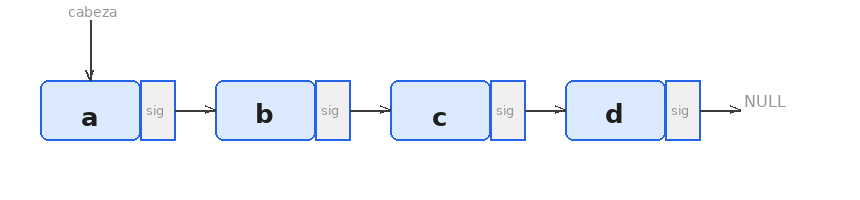
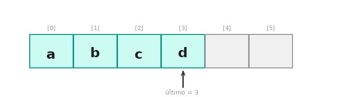
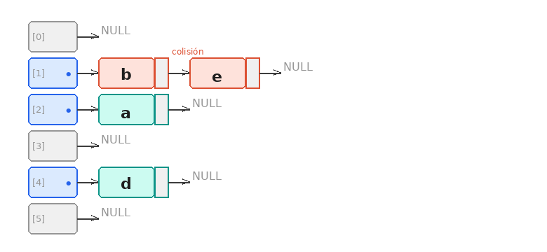

# Glosario de Estructuras de Datos

---

## Tabla de contenidos

- [**Primera Etapa**](#primera-etapa)
  1. [Modelo Función](#1-modelo-función)
  2. [Lista Ordenada — genérica](#2-lista-ordenada--genérica)
     - [Implementación por punteros](#21-implementación-por-punteros)
     - [Implementación por arreglos](#22-implementación-por-arreglos)
  3. [Tabla Hash — genérica](#3-tabla-hash--genérica)
     - [Tabla Hash abierta](#31-tabla-hash-abierta)
     - [Función hash y aleatoriedad](#32-función-hash-y-aleatoriedad)
     - [Redistribución](#33-redistribución)

---

## Primera Etapa

---

## 1. Modelo Función

> **Definición formal:** arreglo asociativo en el que cada llave única se mapea a exactamente un valor. Formalmente es una función parcial sobreyectiva.

**Propiedades**

- Llaves únicas, valores no necesariamente únicos
- Llaves: strings alfanuméricos de máx. 20 caracteres
- Valores: strings de exactamente 20 caracteres (letras `a`–`z`)

**Operaciones:** `Init` · `Done` · `Clear` · `Assign` · `Unassign` · `Lookup` · `Keys` · `Print`

---

## 2. Lista Ordenada — genérica

> **Definición:** secuencia de elementos mantenida en orden según algún criterio de comparación.

**Invariante:** en todo momento, los elementos están ordenados.

**Operaciones genéricas:** insertar · borrar · buscar · recorrer

**Implementaciones concretas:** por punteros y por arreglos (ver subsecciones).

---

### 2.1 Implementación por punteros

Cada elemento se almacena en un nodo con un puntero al siguiente. La inserción recorre la lista hasta encontrar la posición correcta y reencadena los punteros. La búsqueda y el borrado también se realizan secuencialmente.

| Operación | Complejidad |
|:---------:|:-----------:|
| Búsqueda  | `O(n)`      |
| Inserción | `O(n)`      |
| Borrado   | `O(n)`      |
| Espacio   | `O(n)`      |



---

### 2.2 Implementación por arreglos

Los elementos se almacenan en un arreglo contiguo en memoria, manteniendo el orden. La búsqueda puede realizarse mediante búsqueda binaria. La inserción y el borrado requieren desplazar elementos.

| Operación | Complejidad  |
|:---------:|:------------:|
| Búsqueda  | `O(log n)`   |
| Inserción | `O(n)`       |
| Borrado   | `O(n)`       |
| Espacio   | `O(n)`       |



---

## 3. Tabla Hash — genérica

> **Definición:** estructura que mapea llaves a posiciones en un arreglo mediante una función de hash.

**Invariante:** la posición de cada par la determina la función hash aplicada a su llave.

**Operaciones genéricas:** insertar · buscar · borrar

- Acceso en **O(1)** promedio
- Debe manejar colisiones y redistribución cuando el factor de carga supera un umbral

---

### 3.1 Tabla Hash abierta

Las colisiones se resuelven mediante **encadenamiento separado**: cada posición del arreglo contiene una lista enlazada de pares llave-valor que colisionaron.

**Factor de carga:** `λ = n/m`, donde `n` es el número de elementos y `m` la capacidad.

Cuando `λ` supera el umbral (típicamente `0.75`), se redistribuye duplicando la capacidad y reinsertando todos los pares.



---

### 3.2 Función hash y aleatoriedad

La función procesa la llave carácter por carácter acumulando un valor numérico mediante hash polinomial. Se usa el multiplicador **31** por ser primo, lo que reduce la probabilidad de colisiones:

```python
h = 0
for c in key:
    h = (h * 31 + ord(c)) % m
```

`h` se inicializa en `0` y al finalizar el recorrido contiene el índice destino en `[0, m)`.

**Evaluación de aleatoriedad:** se insertan un conjunto representativo de llaves y se mide la distribución de elementos por posición. La métrica concreta es la **varianza** del número de elementos por cubeta:

```
σ² = (1/m) · Σ (cᵢ − λ)²
```

donde `cᵢ` es la cantidad de elementos en la posición `i` y `λ = n/m` es el factor de carga (valor esperado). Una función hash de buena calidad produce `σ²` cercana a `λ` (comportamiento de Poisson); una varianza significativamente mayor indica agrupamiento y degradación del rendimiento.

---

### 3.3 Redistribución

Cuando el factor de carga supera el umbral:

1. Se crea un nuevo arreglo de capacidad `2m`
2. Se recalcula el hash de cada par existente
3. Se reinserta cada par en la nueva posición

**Costo:** `O(n)` — se evalúa midiendo el tiempo real de ejecución en arreglos de distintos tamaños (pequeño, mediano, grande) y comparándolo con el tiempo teórico lineal.

---