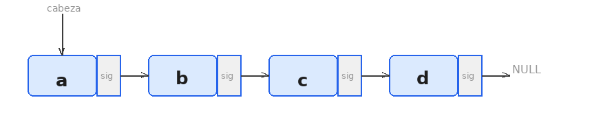
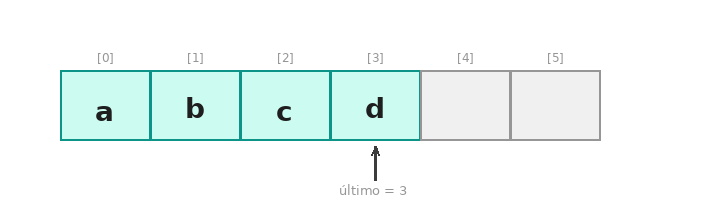
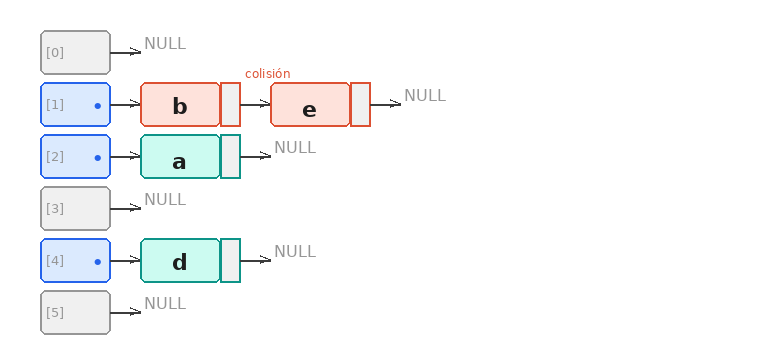
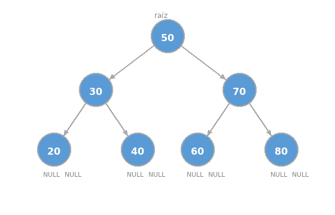
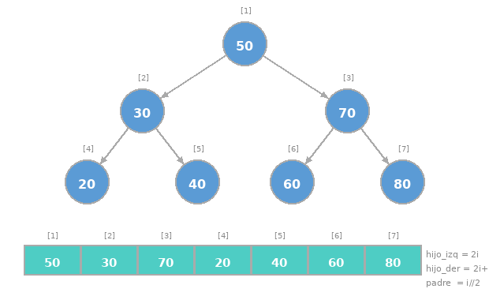
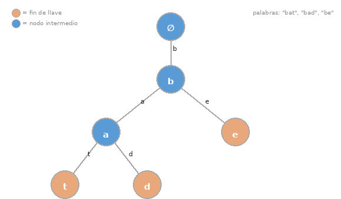
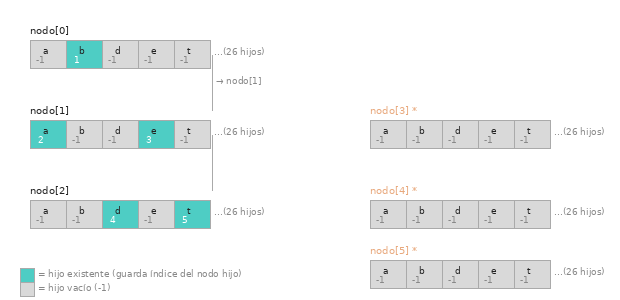

# Glosario de Estructuras de Datos

---

## Tabla de contenidos

- [**Primera Etapa**](#primera-etapa)
   1. [Modelo Función](#1-modelo-función)
   2. [Lista Ordenada — genérica](#2-lista-ordenada--genérica)
      - [Implementación por punteros](#21-implementación-por-punteros)
      - [Implementación por arreglos](#22-implementación-por-arreglos)
   3. [Tabla Hash — genérica](#3-tabla-hash--genérica)
      - [Tabla Hash abierta](#31-tabla-hash-abierta)
      - [Función hash y aleatoriedad](#32-función-hash-y-aleatoriedad)
      - [Redistribución](#33-redistribución)

- [**Segunda Etapa**](#segunda-etapa)

   4. [Árbol de Búsqueda Binaria — genérico](#4-árbol-de-búsqueda-binaria--genérico)
      - [Implementación por punteros](#41-implementación-por-punteros)
      - [Implementación por vector heap](#42-implementación-por-vector-heap)
   5. [Trie — genérico](#5-trie--genérico)
      - [Implementación por punteros](#51-implementación-por-punteros)
      - [Implementación por arreglos](#52-implementación-por-arreglos)

---

## Primera Etapa

---

## 1. Modelo Función

> **Definición formal:** arreglo asociativo en el que cada llave única se mapea a exactamente un valor. Formalmente es una función parcial sobreyectiva.

**Propiedades**

- Llaves únicas, valores no necesariamente únicos
- Llaves: strings alfanuméricos de máx. 20 caracteres
- Valores: strings de exactamente 20 caracteres (letras `a`–`z`)

**Operaciones:** `Init` · `Done` · `Clear` · `Assign` · `Unassign` · `Lookup` · `Keys` · `Print`

---

## 2. Lista Ordenada — genérica

> **Definición:** secuencia de elementos mantenida en orden según algún criterio de comparación.

**Invariante:** en todo momento, los elementos están ordenados.

**Operaciones genéricas:** insertar · borrar · buscar · recorrer

**Implementaciones concretas:** por punteros y por arreglos (ver subsecciones).

---

### 2.1 Implementación por punteros

Cada elemento se almacena en un nodo con un puntero al siguiente. La inserción recorre la lista hasta encontrar la posición correcta y reencadena los punteros. La búsqueda y el borrado también se realizan secuencialmente.

| Operación | Complejidad |
|:---------:|:-----------:|
| Búsqueda  | `O(n)`      |
| Inserción | `O(n)`      |
| Borrado   | `O(n)`      |
| Espacio   | `O(n)`      |



---

### 2.2 Implementación por arreglos

Los elementos se almacenan en un arreglo contiguo en memoria, manteniendo el orden. La búsqueda puede realizarse mediante búsqueda binaria. La inserción y el borrado requieren desplazar elementos.

| Operación | Complejidad  |
|:---------:|:------------:|
| Búsqueda  | `O(log n)`   |
| Inserción | `O(n)`       |
| Borrado   | `O(n)`       |
| Espacio   | `O(n)`       |



---

## 3. Tabla Hash — genérica

> **Definición:** estructura que mapea llaves a posiciones en un arreglo mediante una función de hash.

**Invariante:** la posición de cada par la determina la función hash aplicada a su llave.

**Operaciones genéricas:** insertar · buscar · borrar

- Acceso en **O(1)** promedio
- Debe manejar colisiones y redistribución cuando el factor de carga supera un umbral

---

### 3.1 Tabla Hash abierta

Las colisiones se resuelven mediante **encadenamiento separado**: cada posición del arreglo contiene una lista enlazada de pares llave-valor que colisionaron.

**Factor de carga:** `λ = n/m`, donde `n` es el número de elementos y `m` la capacidad.

Cuando `λ` supera el umbral (típicamente `0.75`), se redistribuye duplicando la capacidad y reinsertando todos los pares.



---

### 3.2 Función hash y aleatoriedad

La función procesa la llave carácter por carácter acumulando un valor numérico mediante hash polinomial. Se usa el multiplicador **31** por ser primo, lo que reduce la probabilidad de colisiones:

```python
h = 0
for c in key:
    h = (h * 31 + ord(c)) % m
```

`h` se inicializa en `0` y al finalizar el recorrido contiene el índice destino en `[0, m)`.

**Evaluación de aleatoriedad:** se insertan un conjunto representativo de llaves y se mide la distribución de elementos por posición. La métrica concreta es la **varianza** del número de elementos por cubeta:

```
σ² = (1/m) · Σ (cᵢ − λ)²
```

donde `cᵢ` es la cantidad de elementos en la posición `i` y `λ = n/m` es el factor de carga (valor esperado). Una función hash de buena calidad produce `σ²` cercana a `λ` (comportamiento de Poisson); una varianza significativamente mayor indica agrupamiento y degradación del rendimiento.

---

### 3.3 Redistribución

Cuando el factor de carga supera el umbral:

1. Se crea un nuevo arreglo de capacidad `2m`
2. Se recalcula el hash de cada par existente
3. Se reinserta cada par en la nueva posición

**Costo:** `O(n)` — se evalúa midiendo el tiempo real de ejecución en arreglos de distintos tamaños (pequeño, mediano, grande) y comparándolo con el tiempo teórico lineal.

---

## Segunda Etapa

---

## 4. Árbol de Búsqueda Binaria — genérico

> **Definición:** árbol binario en el que para cada nodo, todos los elementos del subárbol izquierdo son menores y todos los del subárbol derecho son mayores.

**Invariante:** en todo momento, la propiedad de orden del ABB se mantiene.

**Operaciones genéricas:** insertar · borrar · buscar · recorrer (inorden)

- La búsqueda aprovecha el orden para descartar la mitad del árbol en cada paso
- El rendimiento depende del balance del árbol; en el peor caso (árbol degenerado) es `O(n)`

---

### 4.1 Implementación por punteros

Cada nodo almacena un par llave-valor y dos punteros: uno al hijo izquierdo y otro al derecho. La inserción y búsqueda recorren el árbol comparando llaves en cada nodo hasta encontrar la posición correcta o el nodo buscado.

| Operación | Caso promedio | Peor caso |
|:---------:|:-------------:|:---------:|
| Búsqueda | `O(log n)` | `O(n)` |
| Inserción | `O(log n)` | `O(n)` |
| Borrado | `O(log n)` | `O(n)` |
| Espacio | `O(n)` | `O(n)` |

El peor caso ocurre cuando las llaves se insertan en orden (ascendente o descendente), produciendo un árbol degenerado equivalente a una lista.



---

### 4.2 Implementación por vector heap

El árbol se representa en un arreglo donde los hijos e índice del padre de cada nodo `i` se calculan directamente:

- Hijo izquierdo: `2i`
- Hijo derecho: `2i + 1`
- Padre: `i // 2`

La raíz se almacena en el índice `1` (el índice `0` se deja vacío para simplificar las fórmulas). No hay punteros explícitos; la estructura del árbol está implícita en las posiciones del arreglo.

| Operación | Caso promedio | Peor caso |
|:---------:|:-------------:|:---------:|
| Búsqueda | `O(log n)` | `O(n)` |
| Inserción | `O(log n)` | `O(n)` |
| Borrado | `O(log n)` | `O(n)` |
| Espacio | `O(n)` | `O(n)` |

**Ventaja frente a punteros:** mejor localidad de caché al acceder a elementos contiguos en memoria. **Desventaja:** el arreglo puede desperdiciar espacio si el árbol está muy desbalanceado.



---

## 5. Trie — genérico

> **Definición:** árbol en el que cada nodo representa un prefijo de una llave. Las llaves se almacenan implícitamente en los caminos desde la raíz hasta los nodos marcados como fin de llave.

**Invariante:** cada camino desde la raíz hasta un nodo marcado representa exactamente una llave almacenada.

**Operaciones genéricas:** insertar · borrar · buscar · listar llaves

- La búsqueda tiene complejidad `O(L)` donde `L` es la longitud de la llave, independientemente de `n`
- Eficiente cuando muchas llaves comparten prefijos comunes
- El peor caso de espacio ocurre cuando las llaves tienen prefijos muy distintos entre sí

---

### 5.1 Implementación por punteros

Cada nodo contiene un arreglo de punteros a sus hijos (uno por carácter posible del alfabeto) y un indicador de fin de llave. Para llaves alfanuméricas el arreglo tiene 62 posiciones (26 minúsculas + 26 mayúsculas + 10 dígitos). Los punteros vacíos se almacenan como `None`.

| Operación | Complejidad |
|:---------:|:-----------:|
| Búsqueda | `O(L)` |
| Inserción | `O(L)` |
| Borrado | `O(L)` |
| Espacio | `O(n · L · A)` |

donde `L` es la longitud máxima de llave y `A` es el tamaño del alfabeto.



---

### 5.2 Implementación por arreglos

En lugar de punteros, cada nodo se almacena en un arreglo global y los hijos se referencian mediante índices enteros. Un valor de `-1` indica ausencia de hijo. Esta representación elimina la sobrecarga de los punteros de Python y mejora la localidad de caché.

| Operación | Complejidad |
|:---------:|:-----------:|
| Búsqueda | `O(L)` |
| Inserción | `O(L)` |
| Borrado | `O(L)` |
| Espacio | `O(N · A)` |

donde `N` es el número total de nodos creados y `A` el tamaño del alfabeto.

**Ventaja frente a punteros:** acceso más rápido en la práctica por mejor uso de caché. **Desventaja:** el tamaño del arreglo debe estimarse o crecer dinámicamente.

